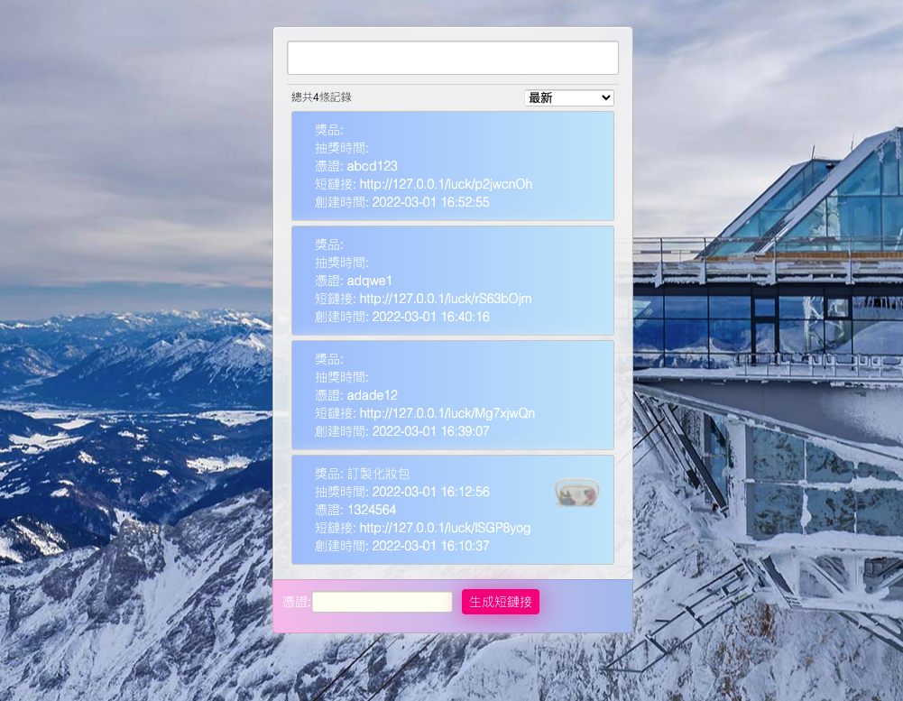

# 圆盘抽奖后端及前端

## github地址:
```
https://github.com/licat233/luckwheel-server.git
```

## 技术栈：
+ 后端：Gin + Redis
+ 前端：react.js  
+ 运维：docker + supervisor  
  

## 使用说明： 
* 默认容器内部使用 80 端口，主机映射端口为 8881 端口，可在config.yaml配置文件中更改  
* 确保已经安装好 docker 与 docker-compose  

## docker一键部署: 
```
docker-compose up -d
```
or
```
docker-compose up --build
```

## 访问地址:
docker-compose运行:
```
127.0.0.1:8881
```
裸跑:
```
127.0.0.1:80
```

## Nginx端口代理:  
```
location / {
    proxy_pass http://127.0.0.1:8881;
    proxy_set_header X-Appengine-Remote-Addr $remote_addr;
    proxy_set_header X-Real-IP $remote_addr;
    proxy_set_header X-Forwarded-For $proxy_add_x_forwarded_for;
    proxy_set_header X-Forwarded-Proto $scheme;
}

# 避免无法访问静态文件
# location ~/static/.*\.(css|js|jpg|png) {
#    # 需要注意两点：
#    # 1.proxy_pass的值不能有 / 
#    # 2.也不能有uri
#    proxy_pass http://127.0.0.1:8881;
# }
```

## 笔记:  

### 更改系统时区，由 UTC -> CST 时区方法
* step 1: 先安装TimeZone数据  
> ``` 
> apk add --no-cache tzdata
> ```

* step 2: 修改 localtime  
> 方式一：覆盖 localtime 文件
> ```
> cp /usr/share/zoneinfo/Asia/Shanghai /etc/localtime
> ```
> 方式二：设置 /etc/localtim 指向文件
> ```
> ln -sf /usr/share/zoneinfo/Asia/Shanghai /etc/localtime
> ```

## 效果圖：  

### 抽獎界面
  

### 後台管理界面
  